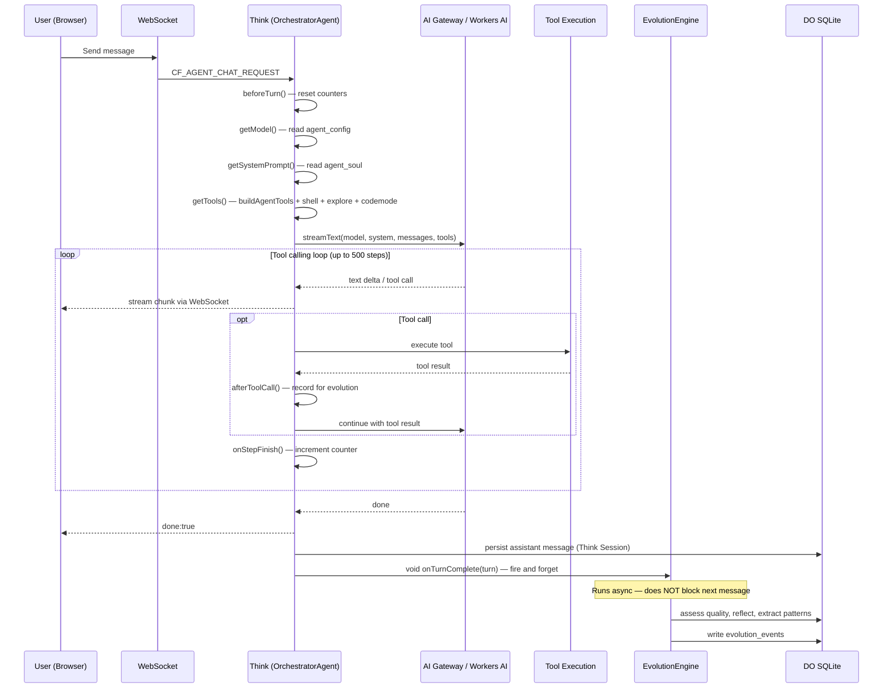
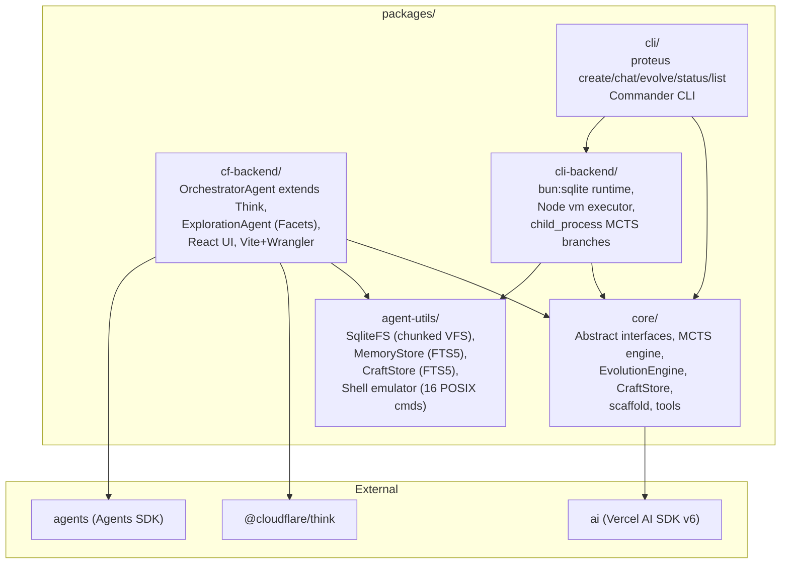
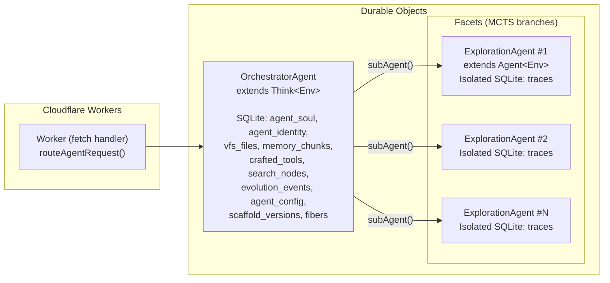

# Architecture

Proteus is a self-evolving AI agent built on Cloudflare's Agents SDK. It uses Monte Carlo Tree Search (MCTS) to explore multiple solution strategies in parallel, learns reusable tool patterns via a CraftStore, and can rewrite its own agentic loop (scaffold) based on observed performance.

## Message Flow

## Package Structure

## Durable Object Layout

## AgentRuntime Interface

The `AgentRuntime` is the central contract. Every backend (CF Workers or CLI) must provide these 6 primitives:

| Primitive | Interface | CF Backend | CLI Backend |
|-----------|-----------|------------|-------------|
| **Storage** | `VFS` + `SqlExecutor` + `RawSqlExec` | SqliteFS over DO SQLite | SqliteFS over bun:sqlite |
| **Memory** | `write`, `append`, `index`, `search`, `read` | MemoryStore (FTS5 BM25) | MemoryStore (FTS5 BM25) |
| **Executor** | `execute(code, providers)` | `new Function()` fallback / LOADER codemode | Bun subprocess sandbox (30s timeout) |
| **LLM** | `stream`, `complete` | Workers AI binding or AI Gateway | AI Gateway via Vercel AI SDK |
| **Schedule** | `after`, `cron`, `fiber` | `agent.runFiber()` (durable) | SQLite-backed fiber |
| **Identity** | `id`, `name`, `scaffold.*` | DO ID + agent_soul table | UUID + ~/.proteus/ directory |

Additional runtime components:
- **CraftStore** — FTS5-indexed learned tool storage
- **SpawnBranch** / **AbortBranch** — MCTS branch lifecycle (Facets on CF, child_process on CLI)

## Think Lifecycle Hooks

The `OrchestratorAgent` extends Think and implements these hooks:

| Hook | When | What Proteus Does |
|------|------|-------------------|
| `getModel()` | Every turn | Read stored model preference from `agent_config`, create Workers AI or AI Gateway model |
| `getSystemPrompt()` | Every turn | Read agent soul from `agent_soul` table |
| `getTools()` | Every turn | Return domain tools + shell + explore + optional codemode. Think auto-adds workspace tools. |
| `configureSession()` | Session init | Memory context block (3000 tokens) + cached prompt |
| `beforeTurn()` | Before inference | Reset turn tracking (tool calls, step count, timer) |
| `afterToolCall()` | After each tool | Record tool call for evolution pattern extraction |
| `onStepFinish()` | After each step | Increment step counter |
| `onChatResponse()` | After turn complete | Fire-and-forget evolution hooks (async, never blocks TurnQueue) |
| `onFiberRecovered()` | DO wake from hibernation | Log interrupted fibers for debugging |
