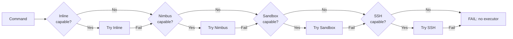
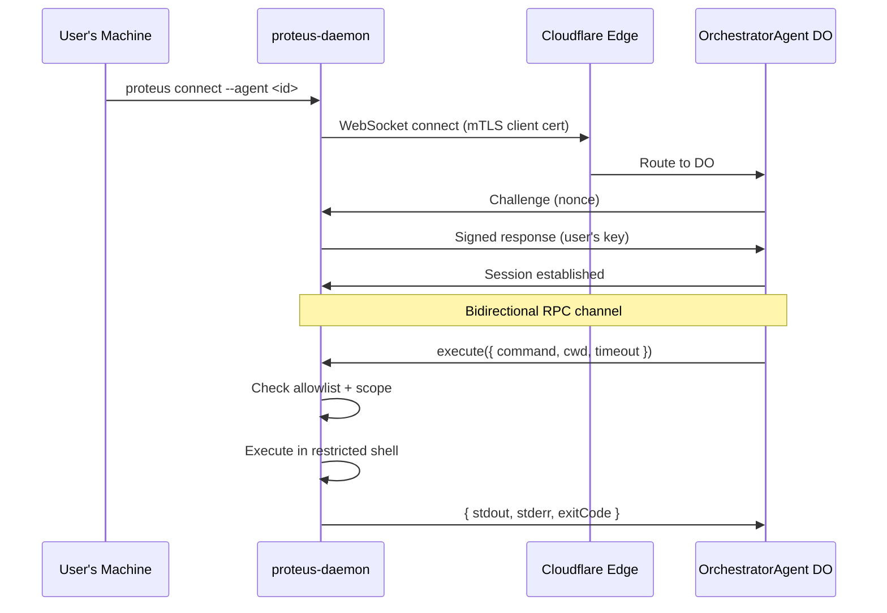
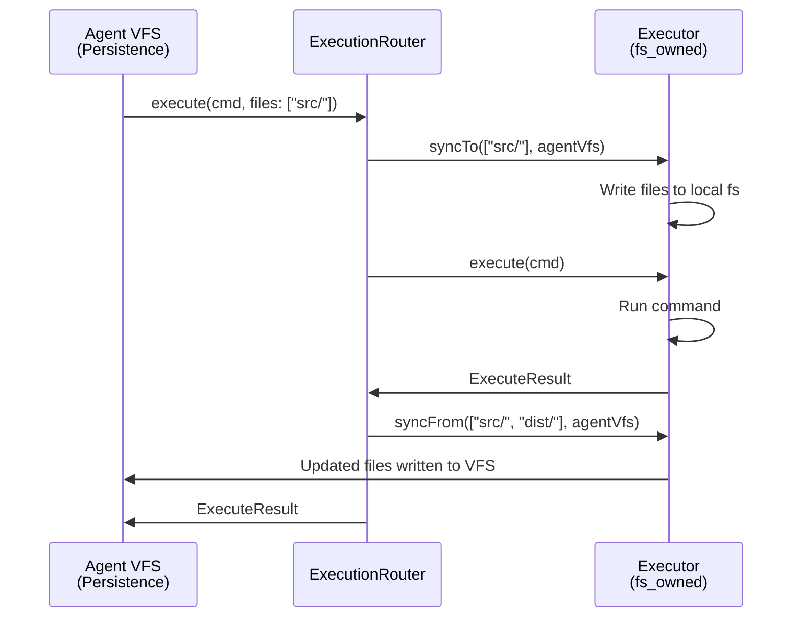

# Execution Layer Architecture Specification

> Version 1.0 — April 2026
> Design principle: **Persistence is immortal. Execution is ephemeral.**

---

## 1. Core Insight: Persistence ≠ Execution

An agent's identity — its memory, learned tools, MCTS search history, scaffold
versions, evolution events — lives in a Durable Object's SQLite database and
survives indefinitely. But the environment where the agent *runs code* is
fundamentally different: it's ephemeral, swappable, and may not even be on the
same machine.

These two concerns have been conflated in the current architecture. The agent's
`Executor` interface (`execute(code, providers)`) is a single function that
hides whether code runs in a V8 isolate, a Bun subprocess, a Linux container,
or on the user's laptop. This works for trivial cases but breaks down when:

- The agent needs to run `npm install` (requires a real filesystem + network)
- The agent needs to compile C code (requires `gcc`, not available in V8)
- The agent needs to access the user's local git repo (requires the user's machine)
- Different tasks within the same conversation need different execution environments

The solution: a formal **Execution Layer** that sits between the persistence
layer (DO SQLite) and the actual execution environment, with a capability-based
routing system that selects the right executor for each task.

```mermaid
graph TB
    subgraph "Persistence Layer (DO SQLite — lives forever)"
        VFS[SqliteFS / VFS]
        Memory[MemoryStore + FTS5]
        Craft[CraftStore]
        MCTS[search_nodes]
        Scaffold[scaffold_versions]
        Evolution[evolution_events]
        Identity[agent_soul + agent_identity]
    end

    subgraph "Execution Router"
        Router{ExecutionRouter}
        CapCheck[Capability<br/>Matcher]
    end

    subgraph "Execution Layer (ephemeral, swappable)"
        Inline[InlineExecutor<br/>V8 isolate<br/>fastest, JS only]
        Nimbus[NimbusExecutor<br/>DO + Facets<br/>shell, node, npm, git]
        Sandbox[SandboxExecutor<br/>CF Container<br/>full Linux, any language]
        SSH[SSHTunnelExecutor<br/>User's PC<br/>full hardware, local repos]
    end

    Router --> CapCheck
    CapCheck --> Inline
    CapCheck --> Nimbus
    CapCheck --> Sandbox
    CapCheck --> SSH

    Router -.->|reads/writes| VFS
    Router -.->|reads/writes| Memory
    Nimbus -.->|file sync| VFS
    Sandbox -.->|file sync| VFS
    SSH -.->|file sync| VFS

    style Inline fill:#1a1a2e,stroke:#4ade80
    style Nimbus fill:#1a1a2e,stroke:#60a5fa
    style Sandbox fill:#1a1a2e,stroke:#a78bfa
    style SSH fill:#1a1a2e,stroke:#f59e0b
```



---

## 2. Formal TypeScript Interfaces

### 2.1 Capability Type System

```typescript
/**
 * Formal capability tokens. Each executor declares which capabilities it
 * supports. The router matches required capabilities against available
 * executors using set inclusion.
 *
 * Lean formalization: Proteus.Execution.ExecutorCapability
 */
type ExecutorCapability =
  // Language runtimes
  | "javascript"         // Can evaluate JS code
  | "typescript"         // Can evaluate TS (implies transpilation)
  | "python"             // Can run Python scripts
  | "native_binary"      // Can execute compiled binaries (gcc output, etc.)

  // Development tools
  | "shell"              // POSIX shell commands (ls, grep, sed, etc.)
  | "npm"                // npm install / run / test
  | "git"                // git clone / commit / push / pull
  | "docker"             // Docker build / run (container-in-container)

  // Filesystem models
  | "fs_shared"          // Shares filesystem with the persistence layer
  | "fs_owned"           // Owns a separate filesystem (needs sync)

  // Network
  | "net_outbound"       // Can make outbound HTTP/TCP requests
  | "net_inbound"        // Can accept inbound connections (serve HTTP)

  // Process management
  | "process_spawn"      // Can spawn child processes
  | "process_long"       // Supports long-running processes (dev servers)
  | "process_signal"     // Can send signals (SIGTERM, SIGKILL)

  // Hardware
  | "gpu";               // GPU access for ML workloads
```

### 2.2 ExecutionLayer Interface

```typescript
/**
 * The contract every executor must satisfy. The router holds multiple
 * ExecutionLayer instances and routes commands based on capability matching.
 */
interface ExecutionLayer {
  /** Stable identifier for this executor instance */
  readonly id: string;

  /** Which kind of executor this is */
  readonly kind: ExecutorKind;

  /** Declared capabilities — immutable after construction */
  getCapabilities(): ReadonlySet<ExecutorCapability>;

  // ── Lifecycle ──────────────────────────────────────────────

  /** Establish connection to the execution environment */
  connect(): Promise<void>;

  /** Tear down connection, release resources */
  disconnect(): Promise<void>;

  /** Check if the executor is currently reachable and healthy */
  isAvailable(): Promise<boolean>;

  // ── Execution ──────────────────────────────────────────────

  /** Execute a command and return results. The primary operation. */
  execute(cmd: ExecuteCommand): Promise<ExecuteResult>;

  // ── Filesystem (capability-gated) ──────────────────────────

  /** Read a file from the executor's filesystem */
  readFile(path: string): Promise<string>;

  /** Write a file to the executor's filesystem */
  writeFile(path: string, content: string): Promise<void>;

  /** List directory contents */
  listFiles(path: string): Promise<string[]>;

  // ── Process management (capability-gated) ──────────────────

  /** Spawn a long-running process (dev server, watcher, etc.) */
  spawn(command: string, opts?: SpawnOptions): Promise<ProcessHandle>;

  // ── File synchronization (for fs_owned executors) ──────────

  /** Push files from agent VFS to executor filesystem */
  syncTo?(paths: string[], agentVfs: VFS): Promise<SyncResult>;

  /** Pull files from executor filesystem to agent VFS */
  syncFrom?(paths: string[], agentVfs: VFS): Promise<SyncResult>;
}

type ExecutorKind = "inline" | "nimbus" | "sandbox" | "ssh";

interface ExecuteCommand {
  /** The command string (shell command, code to eval, etc.) */
  command: string;
  /** Working directory for execution */
  cwd?: string;
  /** Environment variables to inject */
  env?: Record<string, string>;
  /** Timeout in milliseconds (0 = no timeout) */
  timeoutMs?: number;
  /** Stream stdout/stderr as they arrive */
  onStdout?: (chunk: string) => void;
  onStderr?: (chunk: string) => void;
}

interface ExecuteResult {
  stdout: string;
  stderr: string;
  exitCode: number;
  /** Wall-clock duration in milliseconds */
  durationMs: number;
}

interface SpawnOptions {
  cwd?: string;
  env?: Record<string, string>;
  /** If true, process survives executor disconnect */
  detached?: boolean;
}

interface ProcessHandle {
  readonly pid: number;
  readonly id: string;
  kill(signal?: "SIGTERM" | "SIGKILL"): Promise<void>;
  streamLogs(): AsyncIterable<string>;
  waitForExit(): Promise<{ exitCode: number }>;
}

interface SyncResult {
  filesTransferred: number;
  bytesTransferred: number;
  errors: Array<{ path: string; error: string }>;
}
```

### 2.3 ExecutionRouter

```typescript
/**
 * Replaces AgentRuntime.executor. Routes commands to the best available
 * executor based on required capabilities.
 *
 * Formal correctness invariant (Lean: routing_correct):
 *   For any command C with required capabilities R, if router selects
 *   executor E, then R ⊆ E.getCapabilities().
 */
interface ExecutionRouter {
  /** All registered executors, ordered by priority */
  readonly executors: ReadonlyArray<ExecutionLayer>;

  /** The combined capabilities across all available executors */
  readonly capabilities: ReadonlySet<ExecutorCapability>;

  /**
   * Execute a command, automatically routing to the best executor.
   *
   * 1. Determine required capabilities from the command
   * 2. Find all executors that satisfy all required capabilities
   * 3. Select the highest-priority available one
   * 4. On failure, failover to the next qualifying executor
   *
   * Backward-compatible with the old Executor.execute() signature.
   */
  execute(cmd: ExecuteCommand, required?: ExecutorCapability[]): Promise<ExecuteResult>;

  /** Access a specific executor by kind */
  getLayer(kind: ExecutorKind): ExecutionLayer | undefined;

  /** Register a new executor at runtime */
  register(layer: ExecutionLayer, priority?: number): void;

  /** Remove an executor */
  unregister(kind: ExecutorKind): void;
}
```

---

## 3. Capability Matrix

| Capability | Inline | Nimbus | Sandbox | SSH |
|------------|--------|--------|---------|-----|
| `javascript` | **Yes** | **Yes** (V8 facet) | **Yes** (Node/Bun) | **Yes** (host runtime) |
| `typescript` | **Yes** (esbuild) | **Yes** (esbuild-wasm) | **Yes** (tsc/esbuild) | **Yes** |
| `python` | No | No | **Yes** (Python 3.13) | **Yes** (if installed) |
| `native_binary` | No | No | **Yes** (gcc, make) | **Yes** |
| `shell` | No | **Yes** (60+ cmds) | **Yes** (real bash) | **Yes** (real bash) |
| `npm` | No | **Yes** (emulated) | **Yes** (real npm/bun) | **Yes** |
| `git` | No | **Yes** (isomorphic-git) | **Yes** (real git) | **Yes** |
| `docker` | No | No | No | **Yes** (if installed) |
| `fs_shared` | **Yes** | No | No | No |
| `fs_owned` | No | **Yes** (SqliteVFS) | **Yes** (ext4) | **Yes** (host fs) |
| `net_outbound` | No | **Yes** (fetch) | **Yes** (full TCP/UDP) | **Yes** |
| `net_inbound` | No | **Yes** (port registry) | **Yes** (preview URLs) | **Yes** |
| `process_spawn` | No | **Yes** (facets) | **Yes** (real fork) | **Yes** |
| `process_long` | No | **Yes** (vite facet) | **Yes** (startProcess) | **Yes** |
| `process_signal` | No | No | **Yes** (killProcess) | **Yes** |
| `gpu` | No | No | No | **Yes** (if available) |

### Performance Characteristics

| Property | Inline | Nimbus | Sandbox | SSH |
|----------|--------|--------|---------|-----|
| Cold start | 0ms | 0ms (same DO) | 2-10s (container boot) | ~1s (tunnel RTT) |
| Warm latency | <1ms | 5-50ms (RPC) | 50-200ms (container fetch) | 50-500ms (network) |
| Max memory | 128MB (DO limit) | 128MB (DO limit) | Configurable (GB+) | Host RAM |
| Max disk | 10GB (DO SQLite) | 10GB (DO SQLite) | Configurable | Host disk |
| Isolation | V8 isolate | DO boundary | Container (Linux cgroups) | None (user's machine) |
| Persistence | Shares agent VFS | Own VFS (synced) | Ephemeral (backup/restore) | Host filesystem |
| Cost | Free (Workers CPU) | Free (DO compute) | Container compute | Free (user's hardware) |

---

## 4. Executor Implementations

### 4.1 InlineExecutor

The simplest executor. Runs JavaScript in a V8 isolate within the same DO.
On Cloudflare, uses `@cloudflare/codemode` via `LOADER` binding. On CLI,
uses `Bun.spawn` with `addImplicitReturn`.

```typescript
class InlineExecutor implements ExecutionLayer {
  readonly id = "inline";
  readonly kind = "inline" as const;

  getCapabilities() {
    return new Set<ExecutorCapability>(["javascript", "typescript", "fs_shared"]);
  }

  async execute(cmd: ExecuteCommand): Promise<ExecuteResult> {
    // CF: createExecuteTool via LOADER
    // CLI: Bun.spawn with isolated subprocess
    const result = await this.codemode.execute(cmd.command, []);
    return { stdout: String(result.result ?? ""), stderr: "", exitCode: result.error ? 1 : 0, durationMs: 0 };
  }

  // fs_shared: reads/writes go directly to agent VFS
  async readFile(path: string) { return this.vfs.readFile(path, { encoding: "utf8" }) as Promise<string>; }
  async writeFile(path: string, content: string) { await this.vfs.writeFile(path, content); }
}
```

### 4.2 NimbusExecutor

Delegates to a `NimbusSession` Durable Object via RPC. The agent gets a
stub to the Nimbus DO and calls shell commands on it.

```typescript
class NimbusExecutor implements ExecutionLayer {
  readonly kind = "nimbus" as const;
  private stub: DurableObjectStub; // NimbusSession DO

  getCapabilities() {
    return new Set<ExecutorCapability>([
      "javascript", "typescript", "shell", "npm", "git",
      "fs_owned", "net_outbound", "net_inbound",
      "process_spawn", "process_long",
    ]);
  }

  async execute(cmd: ExecuteCommand): Promise<ExecuteResult> {
    // RPC to NimbusSession._rpcExec(cmd.command)
    return this.stub.exec(cmd.command);
  }

  // fs_owned: Nimbus has its own SqliteVFS
  async syncTo(paths: string[], agentVfs: VFS) {
    for (const path of paths) {
      const content = await agentVfs.readFile(path, { encoding: "utf8" });
      await this.stub._rpcWriteFile(path, content as string);
    }
    return { filesTransferred: paths.length, bytesTransferred: 0, errors: [] };
  }
}
```

### 4.3 SandboxExecutor

Uses `@cloudflare/sandbox` (Cloudflare Containers). Full Linux environment
with Python, Node, Bun, git, ripgrep, and any packages from the Dockerfile.
Matches Seal's `SealSandbox` pattern.

```typescript
class SandboxExecutor implements ExecutionLayer {
  readonly kind = "sandbox" as const;
  private sandbox: SandboxHandle; // from getSandbox(env.Sandbox, id)

  getCapabilities() {
    return new Set<ExecutorCapability>([
      "javascript", "typescript", "python", "native_binary",
      "shell", "npm", "git",
      "fs_owned", "net_outbound", "net_inbound",
      "process_spawn", "process_long", "process_signal",
    ]);
  }

  async connect() {
    await this.sandbox.ping(); // wake up container
  }

  async execute(cmd: ExecuteCommand): Promise<ExecuteResult> {
    const t0 = Date.now();
    const result = await this.sandbox.exec(cmd.command, [], {
      cwd: cmd.cwd ?? "/workspace",
      timeout: cmd.timeoutMs,
    });
    return {
      stdout: result.stdout, stderr: result.stderr,
      exitCode: result.exitCode, durationMs: Date.now() - t0,
    };
  }

  async spawn(command: string, opts?: SpawnOptions): Promise<ProcessHandle> {
    const proc = await this.sandbox.startProcess(command, { cwd: opts?.cwd });
    return {
      pid: proc.pid, id: proc.id,
      kill: (sig) => this.sandbox.killProcess(proc.id, sig),
      streamLogs: () => this.sandbox.streamProcessLogs(proc.id),
      waitForExit: () => proc.wait(),
    };
  }

  // Sandbox SDK native file operations
  async readFile(path: string) { return this.sandbox.readFile(path); }
  async writeFile(path: string, content: string) { await this.sandbox.writeFile(path, content); }
  async listFiles(path: string) { return this.sandbox.listFiles(path); }

  // File sync via Sandbox SDK bulk operations
  async syncTo(paths: string[], agentVfs: VFS) { /* batch writeFile */ }
  async syncFrom(paths: string[], agentVfs: VFS) { /* batch readFile */ }
}
```

### 4.4 SSHTunnelExecutor

Connects to the user's machine via a WebSocket bridge (the user runs a
lightweight daemon that connects to the agent's DO via cloudflared tunnel
or direct WebSocket). See §6 for the full security model.

```typescript
class SSHTunnelExecutor implements ExecutionLayer {
  readonly kind = "ssh" as const;
  private ws: WebSocket;

  getCapabilities() {
    // Capabilities are negotiated during connect() — the daemon reports
    // what's available on the user's machine.
    return this.negotiatedCapabilities;
  }

  async connect() {
    // Wait for the user's daemon to connect to the agent's WebSocket
    // endpoint. The daemon sends a capability advertisement on connect.
    this.ws = await this.waitForDaemonConnection();
    this.negotiatedCapabilities = await this.negotiateCapabilities();
  }

  async execute(cmd: ExecuteCommand): Promise<ExecuteResult> {
    // Send command to daemon, daemon executes locally, streams results back
    return this.rpc("execute", cmd);
  }
}
```

---

## 5. ExecutionRouter Design

The router replaces `AgentRuntime.executor` and provides backward compatibility
with the old `execute(code, providers)` signature while adding capability-based
routing and failover.

### Routing Algorithm

```
ROUTE(command, requiredCapabilities):
  1. candidates ← executors.filter(e → requiredCapabilities ⊆ e.getCapabilities())
  2. available  ← candidates.filter(e → e.isAvailable())
  3. IF available is empty → FAIL("No executor available for capabilities: {requiredCapabilities}")
  4. selected ← available[0]  // highest priority
  5. TRY result ← selected.execute(command)
  6. IF success → RETURN result
  7. IF retriable failure:
       available.shift()  // remove failed executor
       GOTO 3             // try next
  8. RETURN failure
```

### Capability Inference

For backward compatibility, the router infers required capabilities from the
command content when the caller doesn't specify them explicitly:

```typescript
function inferCapabilities(command: string): Set<ExecutorCapability> {
  const caps = new Set<ExecutorCapability>();

  if (/\b(npm|yarn|pnpm|bun)\s+(install|run|test|build)/.test(command)) caps.add("npm");
  if (/\b(git)\s+(clone|pull|push|commit|checkout)/.test(command)) caps.add("git");
  if (/\b(python|python3|pip)\b/.test(command)) caps.add("python");
  if (/\b(gcc|g\+\+|make|cmake|cargo|rustc)\b/.test(command)) caps.add("native_binary");
  if (/\b(ls|cat|grep|find|sed|awk|mkdir|rm|cp|mv)\b/.test(command)) caps.add("shell");
  if (/\b(docker|podman)\b/.test(command)) caps.add("docker");

  // Default: if nothing specific detected, assume shell
  if (caps.size === 0) caps.add("javascript");

  return caps;
}
```

### Priority Order

Default priority (configurable per agent):

1. **Inline** — fastest, no overhead, but JS-only
2. **Nimbus** — warm DO, rich shell, no cold start
3. **Sandbox** — full Linux, cold start acceptable for heavy tasks
4. **SSH** — user's machine, only when specifically requested or needed

### Failover Semantics



---

## 6. Security Model

### 6.1 InlineExecutor Security

- **Isolation**: V8 isolate via `@cloudflare/codemode` LOADER binding
- **Filesystem**: Read/write limited to agent's SqliteFS (no host filesystem)
- **Network**: No outbound network access
- **Secrets**: Cannot access env vars or wrangler secrets
- **Risk**: Lowest — sandboxed by V8 + Workers runtime

### 6.2 NimbusExecutor Security

- **Isolation**: Durable Object boundary — separate SQLite, separate memory
- **Filesystem**: Own SqliteVFS (10GB). No access to agent's VFS without sync
- **Network**: Outbound fetch via Workers runtime (subject to egress rules)
- **Process isolation**: Facets (dynamic workers) for `node` execution — each gets own V8 isolate
- **Risk**: Low — DO isolation is strong, but Nimbus shell commands run in-DO (no cgroup)

### 6.3 SandboxExecutor Security

Modeled after Seal's `SealSandbox`:

- **Isolation**: Linux container with cgroups + namespaces
- **Filesystem**: Ephemeral ext4. Destroyed on container death. Backup/restore via R2
- **Network**: Configurable egress allowlist (Seal uses per-repo OAuth grants)
- **Process isolation**: Real process isolation (fork, exec, separate PID namespace)
- **Lifecycle**: `provisioning → ready → recovering → error` state machine
  - Transient errors (500, 503, container disconnect) get automatic retry
  - Non-transient failures increment recovery counter
  - After `MAX_RECOVERY_ATTEMPTS` (3), destroy and reprovision with same ID
- **Risk**: Medium — full Linux means more attack surface, but container boundary is strong

### 6.4 SSHTunnelExecutor Security

This is the most sensitive executor. The agent running on Cloudflare sends
commands to the user's personal machine. The security model must prevent:

1. **Unauthorized access** — only the authenticated user's machines can connect
2. **Command injection** — the agent can't run arbitrary commands beyond what's allowed
3. **Data exfiltration** — the agent can't read files outside scoped directories
4. **Persistence** — the agent can't install backdoors or modify system files

#### Connection Protocol



#### Authentication

1. User installs `proteus-daemon` on their machine
2. Daemon generates an Ed25519 keypair; public key registered with the agent via the web UI
3. On connect, the daemon presents a client certificate (mTLS) signed by the user's key
4. The agent challenges with a nonce; daemon signs with the private key
5. Session is bound to the authenticated user identity

#### Command Allowlist

The daemon maintains a configurable allowlist of permitted command patterns:

```yaml
# ~/.proteus/daemon.yml
permissions:
  # Filesystem scope — agent can only access these directories
  allowed_paths:
    - /home/user/projects/
    - /tmp/proteus/

  # Command allowlist — regex patterns for permitted commands
  allowed_commands:
    - "^(ls|cat|head|tail|wc|grep|find|tree)\\b"  # read-only shell
    - "^git\\b"                                     # git operations
    - "^(npm|yarn|pnpm|bun)\\s+(install|run|test|build|start)"  # package management
    - "^(node|python|python3|bun)\\b"              # language runtimes
    - "^(gcc|g\\+\\+|make|cmake)\\b"              # build tools
    - "^(docker|podman)\\b"                         # containers

  # Explicitly blocked (overrides allowlist)
  blocked_commands:
    - "^(rm\\s+-rf\\s+/|dd\\s+|mkfs|fdisk|shutdown|reboot)"  # destructive
    - "\\b(curl|wget).*\\|.*sh"                                # pipe-to-shell
    - "\\bsudo\\b"                                              # privilege escalation

  # Resource limits
  max_concurrent_processes: 5
  max_execution_time_s: 300
  max_output_bytes: 10_000_000  # 10MB
```

#### Filesystem Scoping

Every file operation is path-checked against `allowed_paths`:

```typescript
function isPathAllowed(path: string, allowedPaths: string[]): boolean {
  const resolved = resolve(path);
  return allowedPaths.some(allowed => resolved.startsWith(resolve(allowed)));
}
```

Symlinks are resolved before checking. Path traversal (`../`) is normalized.

#### Capability Negotiation

On connect, the daemon advertises what's available on the user's machine:

```typescript
interface DaemonCapabilityReport {
  platform: "linux" | "macos" | "windows";
  arch: "x64" | "arm64";
  runtimes: { node?: string; python?: string; bun?: string; go?: string; rust?: string };
  tools: { git?: string; docker?: string; gcc?: string };
  gpu: { cuda?: string; metal?: boolean };
  allowedPaths: string[];
  maxConcurrent: number;
}
```

The `SSHTunnelExecutor` converts this report into `ExecutorCapability` tokens.

#### Session Lifecycle

- Sessions have a configurable timeout (default: 30 minutes of inactivity)
- The daemon heartbeats every 15 seconds; 3 missed heartbeats = disconnect
- On disconnect, all running processes spawned by the agent are killed
- The user can revoke access at any time via the daemon CLI or the web UI

---

## 7. Integration with AgentRuntime

The `ExecutionRouter` replaces `AgentRuntime.executor`:

```typescript
interface AgentRuntime {
  storage: Storage;
  memory: Memory;
  // executor: Executor;  ← OLD: single execute() function
  executor: ExecutionRouter;  // ← NEW: routes to best available executor
  llm: LLM;
  schedule: Schedule;
  identity: Identity;
  craftStore: CraftStore;
  judgeModel?: LLM;
  spawnBranch: SpawnBranch;
  abortBranch: AbortBranch;
}
```

### Backward Compatibility

The `ExecutionRouter` satisfies the old `Executor` interface:

```typescript
// Old code:
const result = await rt.executor.execute(code, providers);

// Still works — ExecutionRouter.execute() infers capabilities
// and routes to the best executor:
const result = await rt.executor.execute({
  command: code,
  timeoutMs: 30_000,
});
```

### Capability Introspection

Tools can query what's available before deciding what to do:

```typescript
// In a tool's execute function:
if (rt.executor.capabilities.has("python")) {
  return rt.executor.execute({ command: `python3 -c "${code}"` }, ["python"]);
} else {
  return rt.executor.execute({ command: code }, ["javascript"]);
}
```

### Per-Backend Construction

```typescript
// CF backend: multiple executors available
function createCFRouter(env: Env, agent: OrchestratorAgent): ExecutionRouter {
  const router = new ExecutionRouter();
  router.register(new InlineExecutor(env.LOADER, agent.rt.vfs), 0);    // priority 0 (highest)
  if (env.NimbusSession) router.register(new NimbusExecutor(env), 1);
  if (env.Sandbox) router.register(new SandboxExecutor(env), 2);
  // SSH executor registered dynamically when user connects daemon
  return router;
}

// CLI backend: just Bun subprocess
function createCLIRouter(): ExecutionRouter {
  const router = new ExecutionRouter();
  router.register(new BunSubprocessExecutor(), 0);  // has ALL capabilities locally
  return router;
}
```

---

## 8. Multi-Executor Usage Patterns

### Pattern 1: Escalation

The agent starts with the fastest executor and escalates when it hits
a capability wall:

```
User: "Build and test this Rust project"

Agent thinks: need `native_binary` + `shell`
  → Inline lacks `native_binary` ✗
  → Nimbus lacks `native_binary` ✗
  → Sandbox has `native_binary` ✓
  → Routes to SandboxExecutor

sandbox.exec("cargo build --release")
sandbox.exec("cargo test")
```

### Pattern 2: Parallel Execution

Different subtasks routed to different executors simultaneously:

```
User: "Analyze this codebase and run the test suite"

Agent uses two executors in parallel:
  1. Nimbus: shell_exec("find . -name '*.ts' | wc -l")   — quick file analysis
  2. Sandbox: exec("npm test")                            — real test execution
```

### Pattern 3: Local + Cloud

Agent works with the user's local repository via SSH while using cloud
compute for heavy operations:

```
User: "Review my local changes and run CI"

  1. SSH: exec("git diff HEAD~3")                — read local changes
  2. SSH: exec("cat src/main.ts")                — read local files
  3. Sandbox: exec("npm test && npm run build")  — CI in the cloud
  4. SSH: exec("git push origin main")           — push from local
```

### Pattern 4: MCTS Branch Isolation

Each MCTS exploration branch gets its own executor instance for isolation:

```
MCTS iteration 1:
  Branch A → Sandbox-A: "try approach using React"
  Branch B → Sandbox-B: "try approach using Vue"
  Branch C → Nimbus: "analyze existing patterns" (lighter task)
```

---

## 9. File Synchronization Protocol

Executors with `fs_owned` capability need a synchronization protocol to
exchange files with the agent's persistence layer.

### Sync Modes

1. **On-demand sync** (default): Files are synced explicitly before/after execution
2. **Watched sync**: File system events on the executor trigger automatic sync-back
3. **Snapshot sync**: Full directory snapshot at execution boundaries

### Protocol



### Conflict Resolution

When both the agent VFS and the executor have modified the same file:

1. **Last-writer-wins** (default): The executor's version overwrites the agent's
2. **Merge**: For text files, attempt a 3-way merge (base = pre-sync snapshot)
3. **Fail**: Reject the sync and report the conflict

---

## Appendix A: Lean Formalization

Formal proofs for the execution layer live in `lean/Proteus/Execution.lean`:

- `ExecutorCapability` as an inductive type
- `capabilitySubsumption`: Sandbox ⊇ Nimbus ⊇ Inline
- `routingCorrect`: router never sends a command to an executor lacking required capabilities
- `failoverPreservation`: if primary fails, fallback satisfies the same capabilities

See the Lean source for complete proofs.
