# MCTS Exploration

Proteus uses Monte Carlo Tree Search (LATS variant, [arXiv:2310.04406](https://arxiv.org/abs/2310.04406)) to explore multiple solution approaches in parallel. Each branch is an isolated Durable Object (Facet) with its own SQLite database.

## Search Flow

```mermaid
flowchart TD
    Start([runMCTS]) --> Init[Create root node<br/>in search_nodes]
    Init --> Budget{budget > 0?}
    Budget -->|No| Conv[Convergence check]
    Budget -->|Yes| Select[UCT Selection<br/>Pick best open node]
    Select --> Expand[Expand: spawn N branches<br/>via subAgent / Facets]
    Expand --> Sim1[Branch 1: explore]
    Expand --> Sim2[Branch 2: explore]
    Expand --> SimN[Branch N: explore]
    Sim1 --> Eval1[Evaluate branch 1]
    Sim2 --> Eval2[Evaluate branch 2]
    SimN --> EvalN[Evaluate branch N]
    Eval1 --> BP[Backpropagation<br/>WITH RECURSIVE CTE<br/>update ancestors]
    Eval2 --> BP
    EvalN --> BP
    BP --> Prune{Score < threshold<br/>AND visits ≥ 2?}
    Prune -->|Yes| PruneNode[Mark pruned<br/>Generate reflection<br/>Write lesson to memory]
    Prune -->|No| Budget
    PruneNode --> Budget
    Conv --> Best{Best terminal node?}
    Best -->|Yes| Success[Write success lesson<br/>Maybe extract crafted tool]
    Best -->|No| Fail[Write failure lesson]

    style Start fill:#1a1a2e
    style Conv fill:#16213e
    style Success fill:#0f3460
    style Fail fill:#533483
```



## UCT Formula

```
UCT(node) = value + W × √(ln(parent_visits) / node_visits)
```

Where:
- `value` = running mean of backpropagated rewards (0-1)
- `W` = exploration constant (default: √2 ≈ 1.414)
- `parent_visits` = number of times the parent was visited
- `node_visits` = number of times this node was visited

Implemented in SQL (from `mcts/uct.ts`):
```sql
SELECT id, 
  value + ? * sqrt(log(MAX(1, ?)) / log(2.718281828) / MAX(1, visits)) as uct
FROM search_nodes 
WHERE status = 'open' AND parent_id = ?
ORDER BY uct DESC LIMIT 1
```

## Backpropagation

Uses a `WITH RECURSIVE` CTE to walk from the evaluated leaf node up to the root, updating each ancestor's running mean:

```sql
WITH RECURSIVE ancestors AS (
  SELECT id, parent_id FROM search_nodes WHERE id = ?
  UNION ALL
  SELECT sn.id, sn.parent_id FROM search_nodes sn
  JOIN ancestors a ON sn.id = a.parent_id
)
UPDATE search_nodes 
SET visits = visits + 1,
    value = (value * visits + ?) / (visits + 1)
WHERE id IN (SELECT id FROM ancestors)
```

**Running mean formula**: `new_value = (old_value × visits + reward) / (visits + 1)`

## Branch Isolation

Each MCTS branch runs in an isolated environment:

| Platform | Mechanism | Isolation |
|----------|-----------|-----------|
| CF Workers | `agent.subAgent(ExplorationAgent, branchId)` — Facets | Separate DO with own SQLite. Proven in Lean: `StorageIsolated` invariant. |
| CF Workers (fallback) | Inline LLM calls | No storage access at all. Captures only LLM config, never agent reference. |
| CLI | `child_process.fork('branch-worker.ts')` | Separate OS process with own SQLite file |

ExplorationAgent has 3 `@callable()` methods:
- `explore(history, craftedTools)` — propose one approach in 2-3 sentences
- `evaluate(task)` — score the approach 0.0-1.0 via LLM
- `generateReflection(task)` — explain what went wrong (for pruned branches)

## search_nodes Table

| Column | Type | Description |
|--------|------|-------------|
| `id` | TEXT PK | Node ID (nanoid) |
| `parent_id` | TEXT | Parent node ID (null for root) |
| `task` | TEXT | The task being explored |
| `action` | TEXT | The approach taken at this node |
| `observation` | TEXT | Result of the exploration |
| `depth` | INTEGER | Depth in tree (root = 0) |
| `visits` | INTEGER | Number of backpropagation passes |
| `value` | REAL | Running mean score (0-1) |
| `status` | TEXT | `open`, `terminal`, `pruned`, `failed` |
| `msg_id` | TEXT | Session message ID for tree navigation |
| `created_at` | INTEGER | Epoch milliseconds |

## Formal Properties (Lean 4)

The MCTS engine has 7 formally verified properties:

| Property | File | Status |
|----------|------|--------|
| Budget terminates (well-founded on Nat) | `Convergence.lean` | Proven |
| Backprop preserves node IDs | `Backpropagation.lean` | Proven |
| Backprop increments visit counts | `Backpropagation.lean` | Proven |
| Initial backprop state is valid | `Backpropagation.lean` | Proven |
| Best open node survives pruning | `Convergence.lean` | Proven |
| Storage isolation is an invariant | `DistributedModel.lean` | All 7 cases proven |
| Branch cannot modify orchestrator | `CapabilitySafety.lean` | Proven |
