# Data Model

All state is stored in a single Durable Object's SQLite database. The schema is split across several subsystems, each owning its tables.

## Entity Relationship

```mermaid
erDiagram
    agent_soul {
        TEXT purpose PK "Immutable agent purpose"
    }
    agent_identity {
        TEXT id PK "Stable UUID"
        TEXT name "Agent name"
        INTEGER created_at "Epoch ms"
    }
    agent_config {
        TEXT key PK "Config key (model, display_name, etc.)"
        TEXT value "Config value"
    }
    vfs_files {
        TEXT path "File path"
        INTEGER chunk_index "Chunk number (0-based)"
        TEXT parent_path "Parent directory"
        BLOB data "File content (up to 1.8MB per chunk)"
        INTEGER is_dir "1 for directories"
        INTEGER size "Total file size"
        INTEGER mtime "Last modified (epoch ms)"
    }
    memory_chunks {
        TEXT id PK "Chunk ID"
        TEXT path "Source file path"
        INTEGER start_line "Start line in source"
        INTEGER end_line "End line in source"
        TEXT hash "SHA-256 of chunk content"
        TEXT text "Chunk text content"
        INTEGER updated_at "Epoch ms"
    }
    memory_chunks_fts {
        TEXT text "FTS5 virtual table (BM25)"
    }
    crafted_tools {
        TEXT name PK "Tool name (snake_case)"
        TEXT description "What the tool does"
        TEXT params "JSON Schema for input"
        TEXT code "Async arrow function body"
        TEXT scope "local or shared"
        INTEGER created_at "Epoch ms"
        INTEGER updated_at "Epoch ms"
    }
    crafted_tools_fts {
        TEXT name "FTS5 virtual table"
        TEXT description "FTS5 virtual table"
    }
    search_nodes {
        TEXT id PK "Node ID (nanoid)"
        TEXT parent_id FK "Parent node"
        TEXT task "MCTS task"
        TEXT action "Approach taken"
        TEXT observation "Result"
        INTEGER depth "Tree depth"
        INTEGER visits "Backprop count"
        REAL value "Running mean score"
        TEXT status "open/terminal/pruned/failed"
        TEXT msg_id "Session message ID"
        INTEGER created_at "Epoch ms"
    }
    evolution_events {
        TEXT id PK "Event ID"
        TEXT type "Event type"
        TEXT message "Description"
        TEXT data "JSON payload"
        INTEGER created_at "Epoch ms"
    }
    scaffold_versions {
        INTEGER version PK "Version number"
        INTEGER written_at "Epoch ms"
        TEXT rationale "Why it was changed"
    }
    fibers {
        TEXT name PK "Fiber name"
        TEXT state "running/completed/failed"
        TEXT snapshot "JSON checkpoint"
        INTEGER started_at "Epoch ms"
        INTEGER updated_at "Epoch ms"
    }

    agent_identity ||--|| agent_soul : "has"
    vfs_files ||--o{ memory_chunks : "indexed by"
    memory_chunks ||--|| memory_chunks_fts : "FTS5 sync"
    crafted_tools ||--|| crafted_tools_fts : "FTS5 sync"
    search_nodes ||--o{ search_nodes : "parent_id"
```

## SqliteFS (Virtual Filesystem)

From `@proteus/agent-utils`. Provides a POSIX-like filesystem backed by a single `vfs_files` table.

**Chunked storage:** Files larger than 1.8MB are split across multiple rows with `chunk_index`. Reads concatenate all chunks. Writes split and store atomically.

**Auto-created parent directories:** Writing to `a/b/c/file.txt` automatically creates directory entries for `a`, `a/b`, `a/b/c`.

**Path normalization:** Resolves `.` and `..`, prevents directory traversal attacks.

**Key operations:**
- `readFile(path)` — concatenate all chunks for the path
- `writeFile(path, data)` — delete old chunks, split data into 1.8MB chunks, insert
- `stat(path)` — return size, mtime, isDir
- `mkdir(path, {recursive: true})` — create intermediate directories
- `rename(old, new)` — atomic rename via SQL UPDATE

## MemoryStore (FTS5 Search)

From `@proteus/agent-utils`. Provides full-text search over markdown files stored in the VFS.

**Schema:** `memory_chunks` table with `memory_chunks_fts` FTS5 virtual table (content-sync via `content='memory_chunks'`).

**Indexing:** Files are chunked using a line-aware sliding window (target 500 chars, 320 char overlap). Each chunk gets a SHA-256 hash for deduplication — unchanged chunks are not re-indexed.

**Search:** FTS5 MATCH with BM25 ranking. Query sanitization removes FTS5 operators and stop words. Falls back to OR-joined tokens if AND query returns no results.

## Think Message Persistence

Think (via the Session class) manages its own message tables:
- `cf_agents_chat_messages` — all chat messages (user + assistant)
- `cf_agents_sessions` — session metadata
- `cf_agents_contexts` — LLM-writable memory context blocks

These are managed by Think internally — Proteus reads via `this.messages` but never writes directly.

## Schema Initialization

Tables are created in `onStart()`:
1. `initAllTables(execRaw)` — core tables (agent_soul, agent_identity, vfs_files, scaffold_versions, evolution_events, crafted_tools, fibers)
2. `initSearchTables(execRaw)` — search_nodes
3. `initScaffoldTables(execRaw)` — scaffold_versions
4. `initCraftScoreTables(execRaw)` — craft_scores
5. `sqliteFS.init()` — ensures vfs_files has correct chunked schema
6. `memoryStore.ensureSchema()` — creates memory_chunks + FTS5 virtual table
7. `craftStore.ensureSchema()` — creates crafted_tools FTS5 + auto-sync triggers

**Migration:** `onStart()` detects old schemas (missing `chunk_index` in vfs_files, missing `start_line` in memory_chunks) and drops/recreates them.
